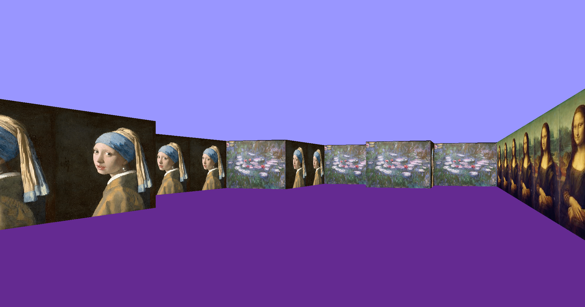
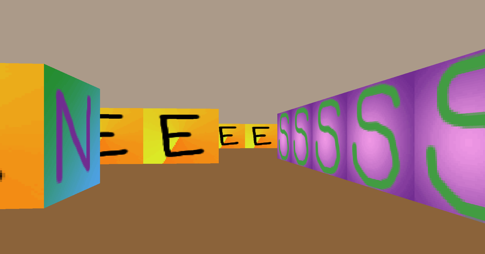
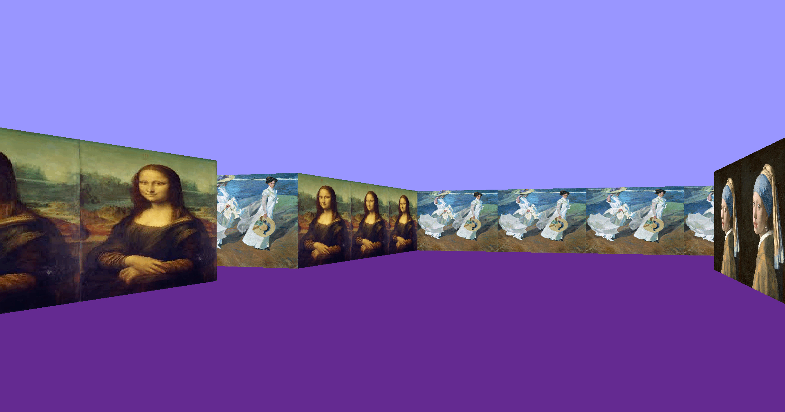
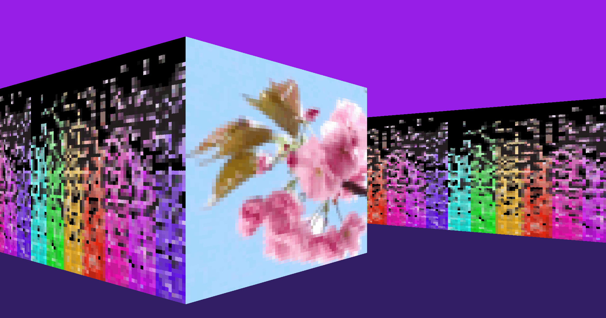

# Cub3d Project

The **Cub3d** project involves creating a 3D environment from a 2D map composed of 0s and 1s. The main concept behind raycasting is to generate rays from the player's position and calculate where they intersect with walls. Depending on the length of the ray, the object representation will occupy more or less space on the screen.

To ensure the 3D space is represented correctly, a window of a defined size is set, with a ray assigned to generate an image for each pixel in the horizontal resolution. This way, the screen will show three sections: sky, floor, and wall. The length of each line depends on the distance from the player to the wall.

This project uses the MLX, a graphical library created by students and staff of the 42 school.

## Images






## Usage

The program can be executed with the following syntax:
```
./cub3d <path_to_map>
```
Where `<path_to_map>` is the path to a valid map file. A few example maps are provided in the `maps/` folder, which you can use for testing purposes.

## Controls

The controls for the game are as follows:

- **Move Forward**: `W`
- **Move Backward**: `S`
- **Move Left**: `A`
- **Move Right**: `D`
- **Turn Left**: Left Arrow (←)
- **Turn Right**: Right Arrow (→)

## Process
### Map Parsing

The first part of the project involves parsing the map provided to the program as an argument, from which the 3D representation will be generated. The file, and thus the parsing process, must be split into two sections. The first section specifies the paths to the wall textures and the color of the ceiling and sky, formatted as follows:
```
NO <north_texture_path>
SO <south_texture_path>
WE <west_texture_path>
EA <east_texture_path>
F <r><g><b>
C <r><g><b>`
```


The order of the elements does not affect the result nor cause errors.

### Map Validity

The map must be valid; this means it should not contain empty spaces or open edges. For example, this is valid:
```
111
1S1
111
```

Whereas this is not:
```
011
1N1
111
```


The 0 in this case should not cause any rendering issues, but to stay within the project guidelines, we decided that the map needs to be closed at all 8 angles (not just 4). The map should also not contain invalid symbols or more than one player. The player is represented by a letter indicating its position and the direction it faces when the game starts.

### Ray Generation

Once the map is parsed and stored in a data structure (in our case, a 2D array), we can start generating the rays.

Our map becomes a grid, and between any two points, there are "infinite" points. That is, we've moved from integer-based representation to one using floats, with decimal precision. The player starts at position 0.5, 0.5 on the grid, shoots rays, and generates images at the speed allowed by the processor.

### Raycasting Algorithm

To cast the rays, we use the **DDA algorithm**, a common line generation technique in computer graphics. It calculates the slope and determines which axis (X or Y) has the greater variability. Based on this, for each step in one axis, a fraction is added to the other axis, creating a relationship between them. The direction of the rays is determined by two factors: the **field of view (FOV)** and the player's directional facing. Once all this information is available, rays are cast in a fan-like pattern, one for each pixel in the horizontal resolution.

### Calculating the Distance to the Wall

When a ray hits an object, the distance to the wall is calculated. There’s a common challenge here: the direction of the ray is calculated once based on the relationship between the X and Y axes. In other words, the ray is generated by adding vectors, and for each addition, the ray's position is updated. However, the ray’s exact impact position on the wall is not always perfectly aligned with a grid point. We can only determine if it has hit the wall or not.

Now, as you correctly pointed out, the distance to the wall is determined by the length of the ray minus its fractional part. This is because if you know a ray intersects at X = 3.4, and there was no intersection at X = 2.4, then the exact impact point is guaranteed to be at X = 3, and the fractional part gives us the precision needed to calculate the correct distance. This helps adjust for the distortion caused by the projection in the 3D view, where the distance is adjusted depending on how far away the wall is.

### Texturizing the Wall

Once the raycasting process is correctly implemented, the next step is texturizing the walls. The texture image from the provided path is scaled according to the distance from the player. This scaling takes into account the wall’s distance from the player and distorts it based on the ray’s impact. The position from which to start rendering the texture is determined by where the ray hits. For instance, if the ray hits the middle of a wall, the texture will start from the middle of its horizontal axis. The texture coordinates are adjusted so that they match the location where the ray hits, ensuring that the wall appears textured according to its position in 3D space.

### Final Adjustments

Finally, collision detection is added to the walls to prevent the player from leaving the map (and thus accessing invalid memory regions). Keymaps for movement are also incorporated to allow the player to navigate the space.
